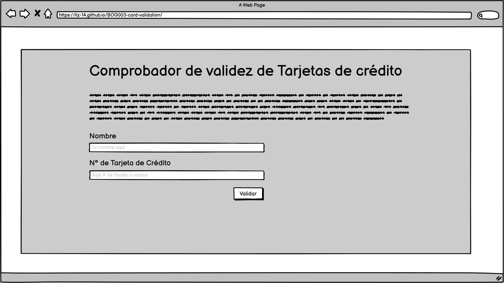
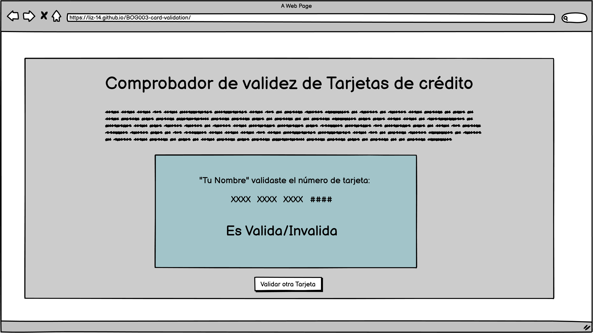
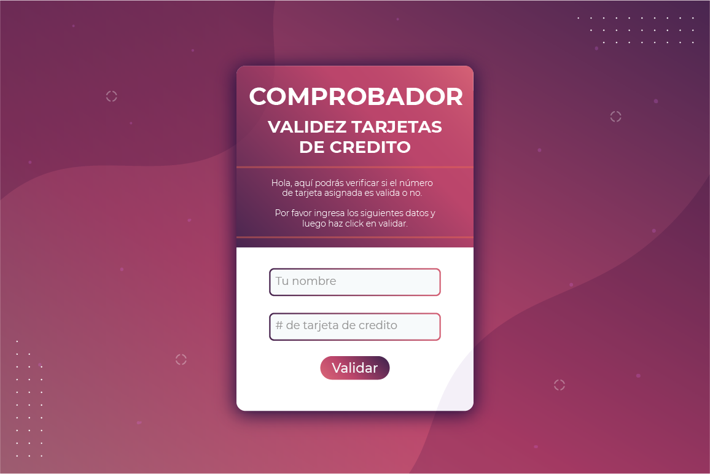
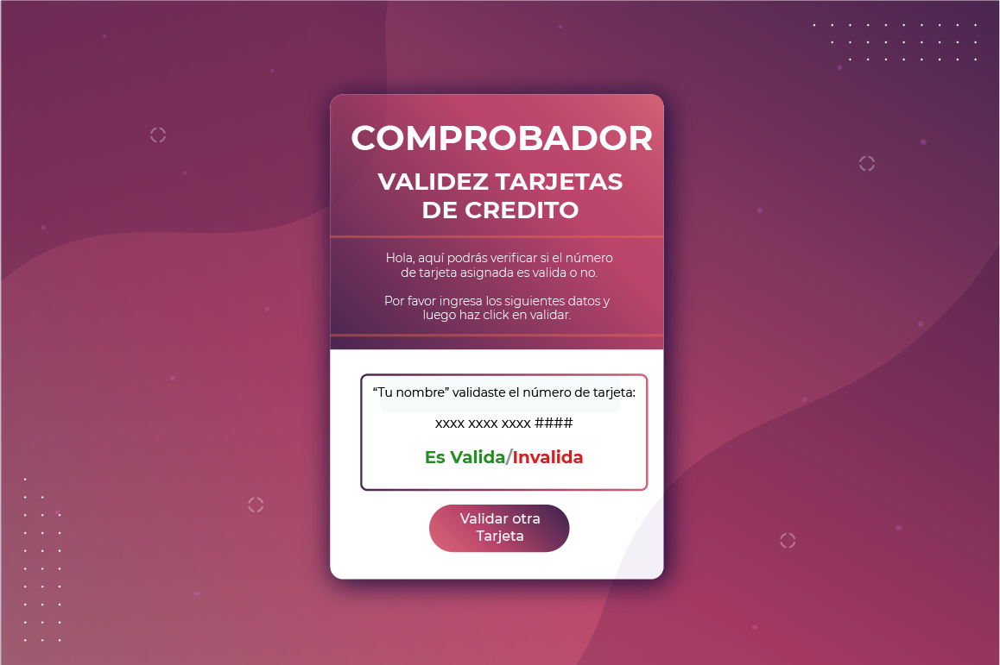
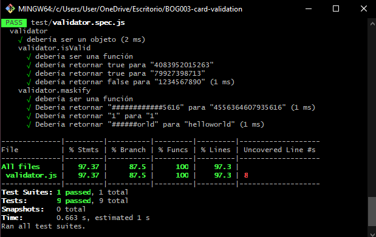

# Comprobador de validez de tarjetas de crédito

La siguiente aplicación web tiene como propósito permitir a una entidad bancaria rectificar si el número que se usara para una tarjeta de crédito es válida o no.

## Investigación UX

* **Usuarios:** Los usuarios serán todos aquellos trabajadores de una entidad bancaria, cuya función sea la de rectificar que los números que se usarán para emitir tarjetas de crédito sean válidas.

* Los trabajadores haran uso del *Comprobador de validez de tarjetas de crédito* para realizar dicha función.

## Pototipo

### Sketch Inicial

#### Coach Feedback
* Poner poco texto en la explicación del funcionamiento de la app (entre el título y el formulario)
* El botón de "validar" ponerlo a la izquierda o centro por convención.
* El resultado "valido e invalido" ponerlos de color verde o rojo según sea el caso.

## Mockup

#### User Feedback
* La interfaz es visualmente atractiva.
* La página web es intuitiva y fácil de usar.

## Página Web Final

## Test

